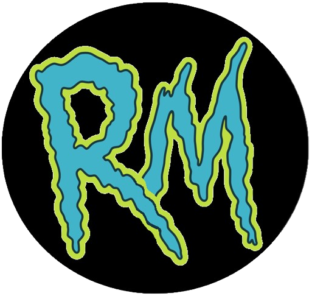
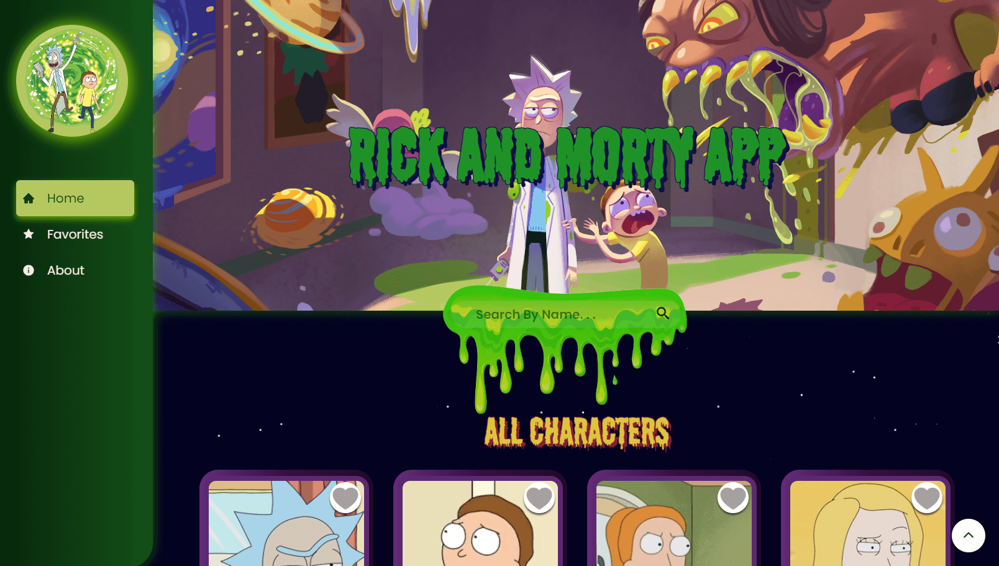
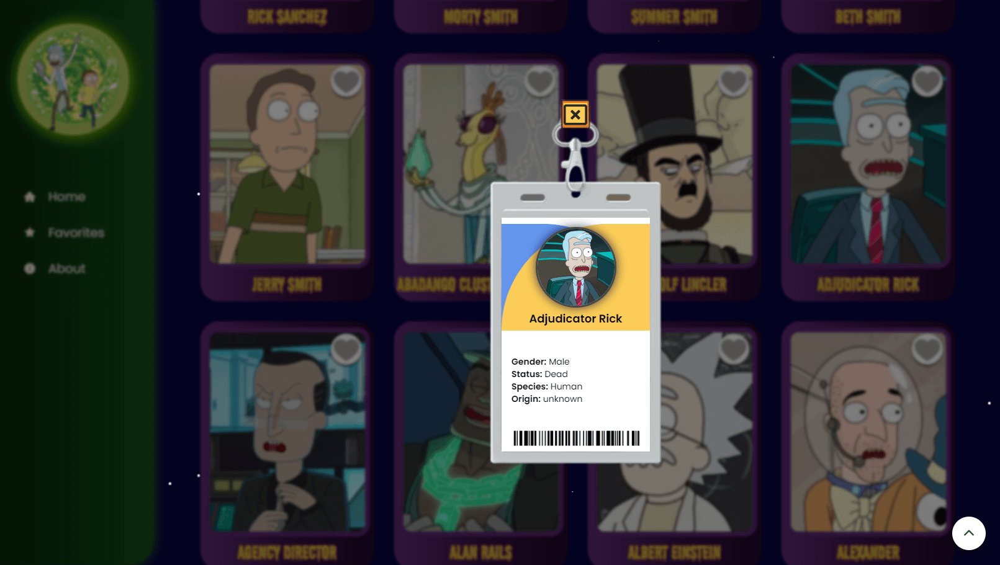
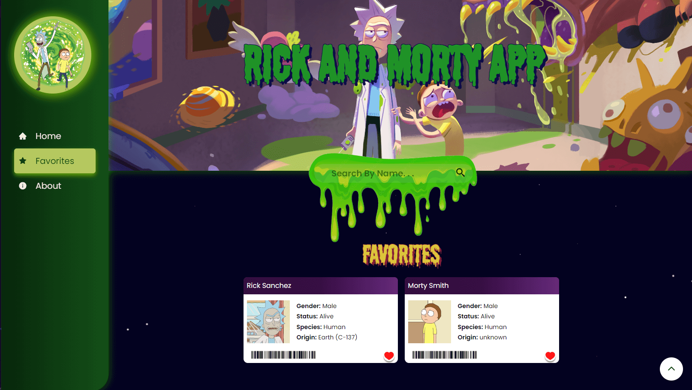
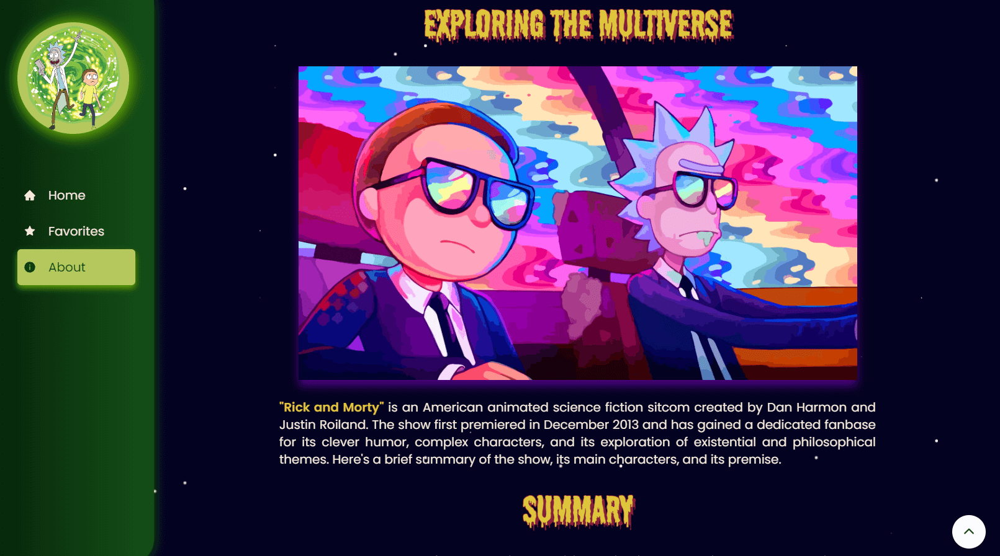
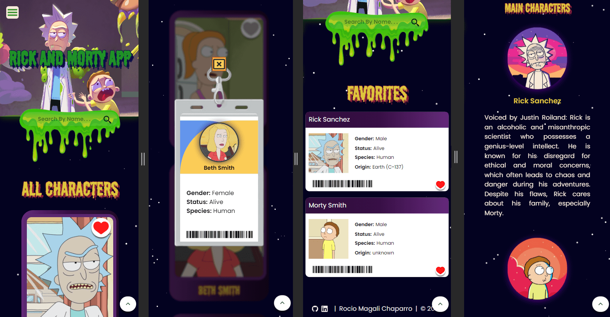

    
    <h1 style="margin-left: 20px" >⚗️ Rick and Morty | App 🛸</h1>

# Proyect

Hello, I am Rocio Magali Chaparro, a Frontend development student. I am excited to showcase a project I worked on independently as practice after completing the course at ADA ITW. I applied everything I learned in the latest module of React Js, including Context.
***

## Index

- [Project Description](#Descripción-del-proyecto)
- [Tools Used](#Herramientas-utilizadas)
- [View Project](#ver-el-proyecto)
- [Project Previews](#preview-del-proyecto)
- [Developers](#desarrolladores)
- [Contact](#contacto)

***

### Project Description

The "Rick and Morty App" is a website where you can explore all the characters from the series, filter them by name, add them to your favorites, and remove them. These selections are saved in your browser, meaning they won't disappear even if you reload the page, unless you remove them from your favorites list. This feature allows for long-term control of information. By clicking on a character's card, you can delve into more detailed information about them.

If you're unfamiliar with the TV series "Rick and Morty" and have come across the website, don't worry! There will be a section that provides a brief description of both the series and the main characters.

Enjoy the fun and explore the galaxy! ✨

***

### Tools Used
- HTML5
- CSS3
- Git
- Github
- Vite
- Axios
- ReactJs
- React Icons
- Tailwind
- Material-UI
- Awesome Reveal
***

### View Project
To view the project, simply paste the following link into your preferred browser:

🧪 https://rick-and-morty-app-zeta-sable.vercel.app/

### Project Previews

Desktop:

Home

Home details

Favorites

About

Mobile:

Views

### Developers

- Rocío Magalí Chaparro

***
### Contact
If you liked the project and are interested in my work, you can contact me on any of my social media platforms.

Rocío Magalí Chaparro
- Github: <a href="https://github.com/Rocio-Ch" name="github">Rocío-Ch</a> 
- Mail: <a href="mailto:rociomagali77@gmail.com" name="mail">rociomagali77@gmail.com</a>
- Linkedin: <a href="https://www.linkedin.com/in/roc%C3%ADo-magal%C3%AD-chaparro-a3530a239/" name="linkedIn">Rocío Magalí Chaparro</a>